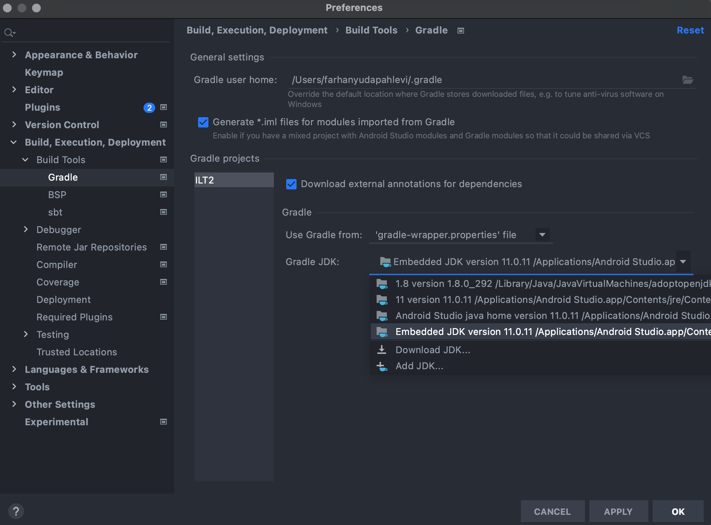

## Bangkit ILT-3 Sample Project

This is sample project based on the slide, most of the sample is based on [the basic sample here](https://github.com/dicodingacademy/demo-ilt-android-bangkit/tree/main/ILT3).

## Troubleshooting

If you can't run the project caused by the Java version, please go to `Preferences` >> `Build, Execution, Deployment` >> `Build Tools` >> `Gradle`, and just change the Java version to the Embedded Java 11.

